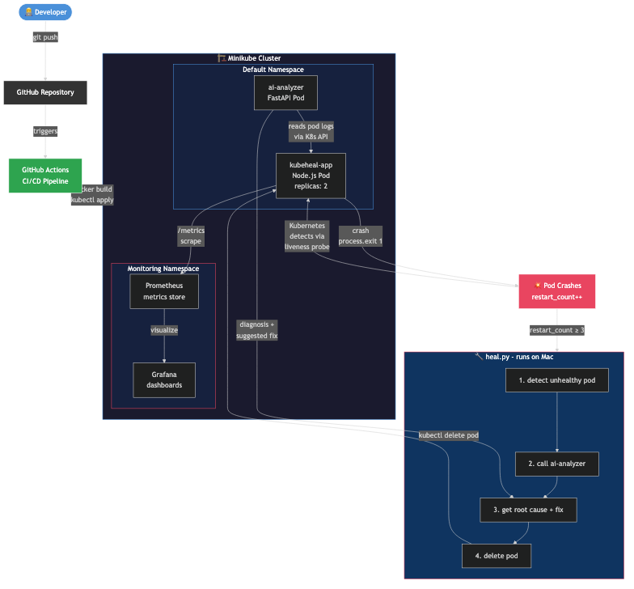

# KubeHeal AI

> Self-healing Kubernetes system with AI-powered log analysis, automated failure detection, ML-based predictions, RAG-based diagnostics, and Prometheus/Grafana monitoring — running fully local on Minikube or production on any Kubernetes cluster.



---

## 🩺 What it does

KubeHeal AI is a complete production-grade platform that:

1. **Detects** failures (CrashLoopBackOff, OOMKilled, ImagePullBackOff, etc.)
2. **Diagnoses** root causes via ML models (RandomForest, XGBoost, LightGBM)
3. **Predicts** failures before they happen using anomaly detection
4. **Retrieves** knowledge via RAG system (FAISS/ChromaDB + Sentence Transformers)
5. **Suggests** fixes using pattern-based analysis and LLM integration
6. **Heals** automatically by restarting pods or adjusting resources
7. **Monitors** everything with Prometheus + Grafana

---

## 🏗️ Architecture

```
┌─────────────────────────────────────────────────────────────┐
│  Streamlit Dashboard  │  Grafana  │  FastAPI (Swagger)      │
├─────────────────────────────────────────────────────────────┤
│  ML Models │ RAG System │ LLM Integration │ Self-Healing     │
├─────────────────────────────────────────────────────────────┤
│  MongoDB │ Redis │ Prometheus │ Kubernetes API              │
├─────────────────────────────────────────────────────────────┤
│  Docker │ Kubernetes (Minikube) │ Helm │ GitHub Actions      │
└─────────────────────────────────────────────────────────────┘
```

---

## 📁 Project Structure

```
Kubeheal-Ai/
├── src/
│   ├── backend/           # FastAPI backend
│   │   ├── api/           # REST API routes
│   │   ├── core/          # Config, security, database
│   │   ├── models/        # Pydantic models
│   │   ├── services/      # Business logic
│   │   └── utils/         # Helpers, logging
│   ├── dashboard/         # Streamlit dashboard
│   │   ├── app.py         # Main dashboard
│   │   ├── components/    # Reusable components
│   │   └── pages/         # Dashboard pages
│   └── models/
│       ├── ml/            # ML model training
│       ├── llm/           # LLM inference
│       └── rag/           # RAG system
├── app/                   # Node.js test app
├── ai-analyzer/           # Legacy AI analyzer
├── healer/                # Self-healing agent
├── k8s/                   # Kubernetes manifests + Helm chart
├── docker/                # Dockerfiles + Compose
├── configs/               # YAML configs, Prometheus, Grafana
├── data/                  # Datasets (raw/processed/features)
├── notebooks/             # Jupyter notebooks
├── tests/                 # Unit, integration, load tests
├── scripts/               # Utility scripts
├── docs/                  # Documentation
├── requirements/          # Python dependencies
├── artifacts/             # Trained models, plots
├── logs/                  # Application logs
└── .github/workflows/     # CI/CD pipelines
```

---

## 🚀 Quick Start

### Prerequisites
- Python 3.9+, Docker Desktop, Minikube, kubectl, Helm

### 1. Setup
```bash
git clone https://github.com/harshdwivediiiii/Kubeheal-Ai.git
cd Kubeheal-Ai
python3 -m venv .venv
source .venv/bin/activate
make install
```

### 2. Train Models
```bash
python scripts/run_training_pipeline.py
```

### 3. Run Services
```bash
# Terminal 1: FastAPI Backend
make run-api

# Terminal 2: Streamlit Dashboard
make run-dashboard

# Terminal 3: Self-Healing Agent
python healer/heal.py
```

### 4. Docker Deployment
```bash
make docker-build
make docker-up
```

### 5. Kubernetes Deployment
```bash
minikube start --driver=docker --cpus=4 --memory=8192
make k8s-deploy
```

---

## 📊 AI/ML Features

| Model | Type | Purpose |
|-------|------|---------|
| RandomForest | Classification | Failure prediction |
| XGBoost | Classification | Failure prediction |
| LightGBM | Classification | Failure prediction |
| Isolation Forest | Anomaly Detection | Metric anomalies |
| Gradient Boosting | Classification | Severity classification |
| Sentence Transformers | Embeddings | RAG system |
| LLM (OpenAI/Anthropic/Groq) | Text Generation | Fix suggestions |

---

## 🔌 API Endpoints

| Endpoint | Description |
|----------|-------------|
| `GET /health` | Health check |
| `POST /auth/token` | JWT authentication |
| `GET /pods/` | List all pods |
| `GET /pods/{ns}/{pod}/logs` | Get pod logs |
| `GET /pods/{ns}/{pod}/predict` | Predict pod failure |
| `GET /alerts/` | List alerts |
| `POST /alerts/rules` | Create alert rule |
| `POST /analyze/logs` | Analyze pod logs |
| `POST /analyze/root-cause` | Root cause analysis |
| `POST /analyze/suggest-fix` | Get fix suggestion |
| `GET /metrics/cluster` | Cluster metrics |
| `GET /metrics/prometheus/query` | PromQL query |

---

## 🐳 Docker Images

- `kubeheal-backend` - FastAPI backend
- `kubeheal-dashboard` - Streamlit dashboard
- `kubeheal-ai-analyzer` - ML/AI service

---

## ☸️ Kubernetes

- Deployments with HPA autoscaling
- Services with ClusterIP
- Ingress with nginx
- RBAC for pod access
- ConfigMaps and Secrets
- PersistentVolumeClaims
- Network policies
- Helm chart included

---

## 📈 Monitoring

- Prometheus metrics scraping
- Grafana dashboards (auto-provisioned)
- Alertmanager rules
- Custom alert rules for K8s failures
- Node Exporter integration

---

## 🤖 CI/CD

- GitHub Actions: lint → test → build → push → deploy
- Docker image building and pushing
- Automatic k8s deployment
- Nightly model retraining
- Code coverage reports

---

## 📚 Datasets

The project includes 25+ datasets for training:
- Kubernetes Pod Failure, Prometheus Metrics, Linux Logs
- HDFS, BGL, OpenStack logs
- Failure Prediction, Anomaly Detection
- Server/Container/Node Metrics
- Synthetic CrashLoopBackOff data
- CVE, MITRE ATT&CK, Incident Reports

---

## 🛡️ License

MIT License - see [LICENSE](LICENSE)

---

## 🤝 Contributing

See [CONTRIBUTING.md](CONTRIBUTING.md)

---

## 📋 Roadmap

See [ROADMAP.md](docs/roadmap.md)

---

Built with ❤️ by [Harsh Dwivedi](https://github.com/harshdwivediiiii)
